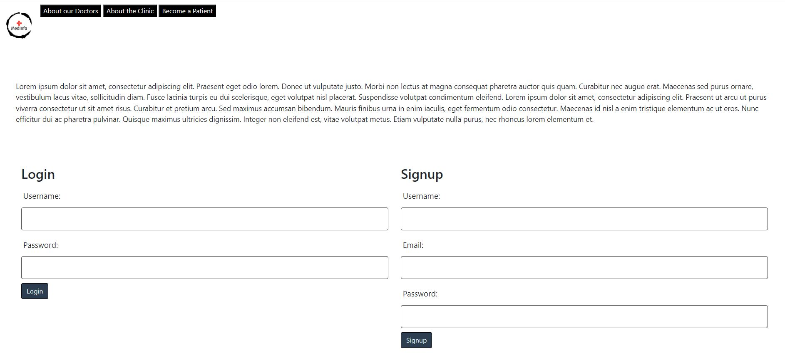
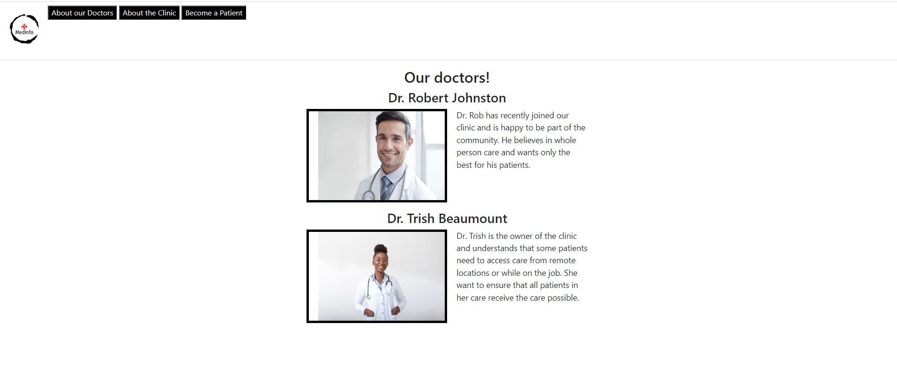
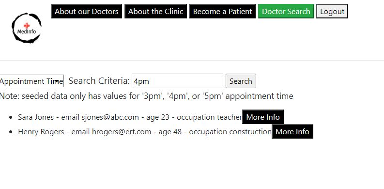
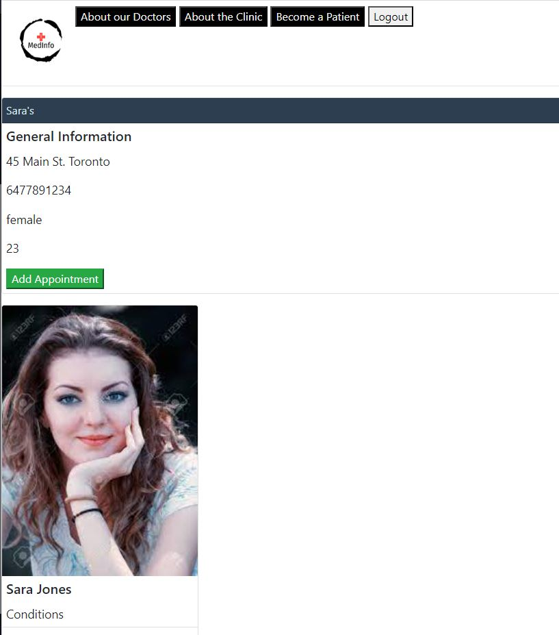
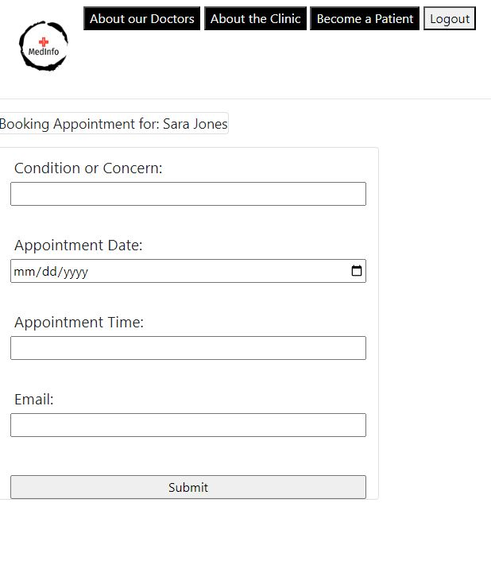

# MEDINFO

<a href='https://floating-sands-48118-d38c73d975f6.herokuapp.com/'>Deployment</a>

## Description

A tracker for medical information to be used by a clinic. Has 3 authorization levels: not logged in, logged in as patient, and logged in as doctor. The levels allow different access to pages across the site. Patients are capable of seeing their indivial information including examination notes and future/past appointments. Doctors are able to view the information for all patients and search the patient database.  

For searching patients you can use 'sara jones'

## Login Details

Doctor
User: robjohnston234
Pass: pass122

Patient
User: sjones123
Pass: 1234

## Current Issues

 - patient image is hard coded
 - patient model has too many fields
 - token disappears when accessing general pages after logging in

## Source & Contributors

This was cloned from a repo I made during the University of Toronto boot camp as part of a team. It was cloned so I can modify it by myself without affecting the original code.

<a href='https://github.com/LeopoldoGurgel/Project2'>Original Repo</a>

## SCREENSHOTS

 
 
 
 
 

